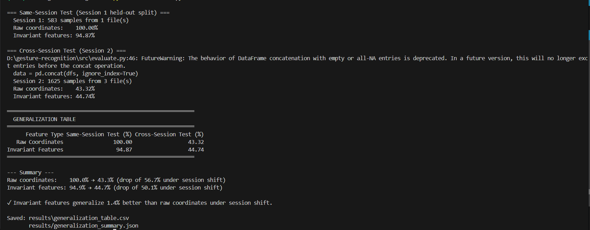
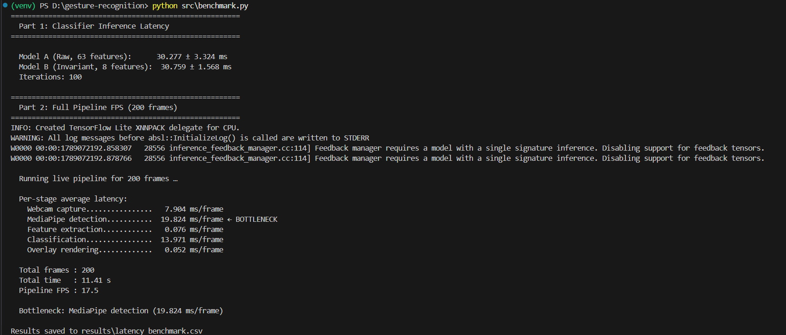

# Real-Time Hand Gesture Recognition Pipeline

A complete end-to-end pipeline for recognizing hand gestures in real time using webcam input, MediaPipe hand landmark detection, and scikit-learn classifiers. The project compares **raw coordinate features** against **invariant geometric features** to study how feature engineering affects generalization across different recording conditions.

## Project Overview

This project implements:

1. **Data collection** — webcam-based tool for recording hand landmark data across multiple sessions
2. **Feature engineering** — two parallel extraction paths (raw coordinates vs. geometric invariants)
3. **Model training** — two Random Forest classifiers trained on the same data but different features
4. **Generalization evaluation** — a 2×2 accuracy table comparing both models on same-session and cross-session test data
5. **Latency benchmarking** — per-stage timing of the full pipeline to identify bottlenecks
6. **Live deployment** — real-time gesture recognition with bounding box, label, and confidence overlay

## Gesture Classes

| Key | Class        | Description                                  |
| --- | ------------ | -------------------------------------------- |
| `1` | `open_palm`  | All fingers extended, palm facing camera     |
| `2` | `fist`       | All fingers curled into a fist               |
| `3` | `thumbs_up`  | Thumb extended upward, others curled         |
| `4` | `peace_sign` | Index and middle fingers in V shape          |
| `5` | `pointing`   | Index finger extended, others curled         |

## Project Structure

```
gesture-recognition/
├── data/
│   ├── raw/                    # Saved landmark CSVs per session
│   └── README.md               # Data collection protocol & schema
├── src/
│   ├── collect_data.py         # Webcam-based data collection tool
│   ├── features.py             # Raw vs invariant feature extraction
│   ├── train.py                # Trains + saves both model variants
│   ├── evaluate.py             # Generates the 2×2 generalization table
│   ├── benchmark.py            # Latency + FPS benchmarking
│   └── live_demo.py            # Real-time inference demo
├── models/                     # Saved trained models (.pkl)
├── results/
│   ├── generalization_table.csv
│   └── latency_benchmark.csv
├── screenshots/                # Live demo and results screenshots
├── requirements.txt
└── README.md
```

---

## Setup Instructions

### 1. Create a virtual environment

```bash
python -m venv venv

# Windows
venv\Scripts\activate

# macOS / Linux
source venv/bin/activate
```

### 2. Install dependencies

```bash
pip install -r requirements.txt
```

### 3. Run the pipeline (in order)

```bash
# Step 1: Collect training data (Session 1)
python src/collect_data.py --session 1 --note "Normal lighting, ~40cm from laptop, sitting at desk"

# Step 2: Collect independent test data (Session 2) — different conditions!
python src/collect_data.py --session 2 --note "Different lighting / distance / angle from Session 1"

# Step 3: Train both models on Session 1
python src/train.py --session 1

# Step 4: Evaluate generalization (produces the 2×2 table)
python src/evaluate.py --train-session 1 --test-session 2

# Step 5: Run latency benchmarks
python src/benchmark.py

# Step 6: Launch live demo
python src/live_demo.py
```

---

## Feature Engineering

All features are extracted from 21 MediaPipe hand landmarks, each providing `(x, y, z)` coordinates.

### Path A — Raw Coordinates (63 features)

The flattened `(x₀, y₀, z₀, x₁, y₁, z₁, …, x₂₀, y₂₀, z₂₀)` values exactly as reported by MediaPipe.

- **Not** scale-invariant: a hand closer to the camera produces larger coordinate values.
- **Not** translation-invariant: hand position in the frame changes all values.

### Path B — Invariant Geometric Features (8 features)

Scale- and translation-invariant features derived from the landmark geometry:

#### Features 1–5: Normalized Fingertip Distances

$$d_i = \frac{\text{dist}(\text{wrist},\ \text{fingertip}_i)}{\text{dist}(\text{wrist},\ \text{middle\_MCP})}$$

where:
- **wrist** = landmark 0
- **fingertip\_i** ∈ {thumb tip (4), index tip (8), middle tip (12), ring tip (16), pinky tip (20)}
- **middle\_MCP** = landmark 9 (scale normalization anchor)
- **dist(A, B)** = √((Bₓ−Aₓ)² + (Bᵧ−Aᵧ)² + (B_z−A_z)²)

Dividing by the wrist-to-middle-MCP distance normalizes for hand size (scale invariance). Using distances relative to the wrist provides translation invariance.

#### Features 6–8: Inter-Finger Angles

$$\theta = \arccos\!\left(\frac{\vec{v_1} \cdot \vec{v_2}}{|\vec{v_1}| \times |\vec{v_2}|}\right)$$

| Feature | Vector 1 (MCP → Tip) | Vector 2 (MCP → Tip) |
| ------- | -------------------- | -------------------- |
| 6       | Index (lm5 → lm8)   | Middle (lm9 → lm12)  |
| 7       | Middle (lm9 → lm12) | Ring (lm13 → lm16)   |
| 8       | Ring (lm13 → lm16)  | Pinky (lm17 → lm20)  |

Each finger vector points from the MCP joint to the fingertip. Angles are inherently scale- and translation-invariant.

---

## Cross-Session Test Protocol

> **⚠️ Critical:** Collecting data under only one condition does not test generalization.

**Session 1 (training)** — 583 samples, collected under normal conditions:
- Normal room lighting
- ~40 cm from camera
- Sitting at desk

**Session 2 (independent test)** — 619 samples, collected under **deliberately different** conditions:
- Changed lighting, distance from camera, and/or angle relative to Session 1

Session 2 data was **never** used for training — it exists solely to measure how well each model generalizes beyond training conditions.

**Per-class sample counts:**

| Class | Session 1 (train) | Session 2 (test) |
|---|---|---|
| open_palm | 107 | 134 |
| fist | 126 | 120 |
| thumbs_up | 127 | 118 |
| peace_sign | 73 | 122 |
| pointing | 150 | 125 |
| **Total** | **583** | **619** |

---

## Results

### Generalization Table

|                    | Same-Session Test | Cross-Session Test |
| ------------------ | :---------------: | :----------------: |
| Raw Coordinates    |     **100.00%**   |      **29.89%**    |
| Invariant Features |     **94.87%**    |      **57.19%**    |



**Interpretation:**

- Raw coordinates dropped from 100.0% same-session to 29.9% cross-session — a **70.1 percentage-point collapse**, falling to barely above the 5-class random baseline of ~20%.
- Invariant features dropped from 94.9% same-session to 57.2% cross-session — a much smaller **37.7 percentage-point drop**.
- **Invariant features generalized 27.3 percentage points better than raw coordinates** under a genuine session shift.

The raw-coordinate model's apparent "perfect" same-session score was misleading — it had learned incidental details of that one session's camera distance and hand positioning rather than the actual gesture shapes, so its accuracy nearly collapsed once evaluated on Session 2's different conditions. The invariant-feature model started with a slightly lower same-session score but held up far better under real session variation, confirming that normalizing distances by hand scale and using rotation/translation-invariant angles captures the gesture itself rather than incidental camera setup.

### Latency / FPS Benchmark

Two independent benchmark runs were recorded to check consistency:

**Classifier-only inference latency** (single-sample `predict()` call, averaged over 100 calls):

| Model | Run 1 | Run 2 |
|---|:---:|:---:|
| Raw-coordinate classifier (63 features) | 29.084 ± 4.984 ms | 30.660 ± 2.227 ms |
| Invariant-feature classifier (8 features) | 28.892 ± 5.154 ms | 30.718 ± 2.155 ms |

**Full pipeline, per-stage breakdown** (live webcam, 200 frames):

| Stage | Run 1 | Run 2 |
| ------------------- | :---: | :---: |
| Webcam capture      | 6.887 ms | 6.906 ms |
| MediaPipe detection | 19.886 ms | 20.658 ms ← bottleneck |
| Feature extraction  | 0.128 ms | 0.090 ms |
| Classification      | 23.991 ms ← bottleneck | 15.327 ms |
| Overlay rendering   | 0.062 ms | 0.040 ms |
| **Full pipeline FPS** | **15.3** | **18.0** |



**Bottleneck analysis:** The bottleneck stage actually changed between the two runs — MediaPipe's neural-network-based hand detection and the Random Forest classification step turned out to be comparably expensive (roughly 15–24 ms each), rather than one clearly dominating as initially expected. Feature extraction is essentially free (under 0.15 ms) in both runs, confirming the 8-feature geometric computation adds negligible overhead compared to the raw pass-through. Classifier latency (~29–31 ms) is higher than a Random Forest's raw compute would suggest — most of that is scikit-learn's per-call Python/array-conversion overhead rather than actual model computation.

---

## Live Demo

The live demo automatically selects whichever model achieved the higher cross-session accuracy in `results/generalization_summary.json` — in this project, that's the **invariant-features model** (57.2% vs. 29.9%).


### Demo Video

📹 **[Watch the Full Real-Time Demo](https://drive.google.com/file/d/1wCcpNjM6Wg5KUs-4nvpv_IGSr3LKESDE/view?usp=sharing)**

---

## Technical Details

- **Classifier:** Random Forest (100 estimators, scikit-learn)
- **Hand detection:** MediaPipe Hands (21 3D landmarks, single hand)
- **Train/test split:** 80/20 stratified, random_state=42
- **Model selection for live demo:** automatically picks the model with the highest cross-session accuracy from `results/generalization_summary.json`

## Dependencies

| Package        | Version   |
| -------------- | --------- |
| opencv-contrib-python | 4.11.0.86 |
| mediapipe      | 0.10.14   |
| scikit-learn   | 1.5.1     |
| numpy          | 1.26.4    |
| pandas         | 2.2.2     |
| joblib         | 1.4.2     |
